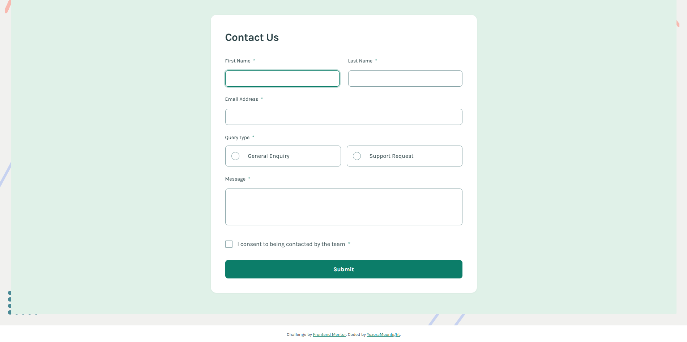
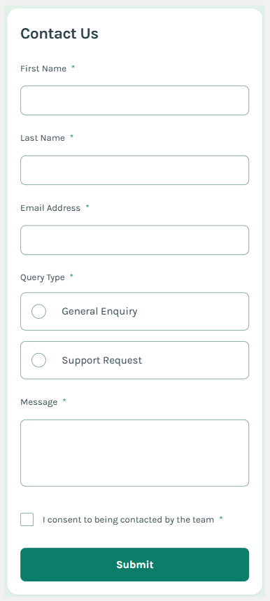

# Frontend Mentor - Contact Form Solution

This is a solution to the [Contact form challenge on Frontend Mentor](https://www.frontendmentor.io/challenges/contact-form--G-hYlqKJj). Frontend Mentor challenges help you improve your coding skills by building realistic projects.

## Table of Contents

- [Overview](#overview)
  - [The Challenge](#the-challenge)
  - [Screenshot](#screenshot)
  - [Links](#links)
- [My Process](#my-process)
  - [Built With](#built-with)
  - [What I Learned](#what-i-learned)
  - [AI Collaboration](#ai-collaboration)
- [Author](#author)

## Overview

### The Challenge

Users should be able to:

- ✅ Complete the form and see a success toast message upon successful submission
- ✅ Receive form validation messages if:
  - A required field has been missed
  - The email address is not formatted correctly
- ✅ Complete the form only using their keyboard
- ✅ Have inputs, error messages, and the success message announced on their screen reader
- ✅ View the optimal layout for the interface depending on their device's screen size
- ✅ See hover and focus states for all interactive elements on the page

### Screenshot

**Desktop View:**

**Mobile View:**

### Links

- Solution URL: [GitHub Repository](https://github.com/YozoraMoonlight/contact-form)
- Live Site URL: [Live Demo on Vercel](https://contact-form-delta-virid.vercel.app/)

## My Process

### Built With

- Semantic HTML5 markup
- CSS custom properties (CSS variables)
- CSS Grid & Flexbox
- Mobile-first responsive design
- Vanilla JavaScript (no frameworks)
- CSS animations and transitions
- ARIA attributes for accessibility
- Custom-styled form controls (radio buttons, checkboxes)

### What I Learned

This was a learning experience in understanding how modern web applications are built:

**My Understanding of Web Development Basics:**

1. **The Three Building Blocks:**
   - **HTML** = Structure (the skeleton of the page)
   - **CSS** = Styling (the skin/clothes - makes it look good)
   - **JavaScript** = Functionality (the muscles/brain - makes things work)

2. **How Form Validation Works:**
   - When you click submit without filling anything → JS shows errors
   - When you type an invalid email → JS recognizes the wrong format
   - When you start typing in a field with an error → JS clears it for instant feedback

3. **React vs Vanilla JavaScript:**
   - MagicPattern created a React prototype
   - I wanted plain HTML/CSS/JS files for deployment
   - Successfully converted between the two with AI assistance

**What I Actually Got From This Project:**

Even though I didn't write the code myself:
- ✅ I understand what the three core web technologies do
- ✅ I learned that AI tools have limitations (React ≠ vanilla, conversion was needed)
- ✅ I navigated a real developer workflow (Git, GitHub, deployment, README)
- ✅ I shipped something live on the internet that actually works
- ✅ I learned I can explore tech stuff when curious without being a "coder"

**Honest Takeaway:**

This was a curiosity experiment to see if I could convert a MagicPattern React prototype into plain HTML/CSS/JS and deploy it. I used AI (Kiro/Claude) to handle all the actual coding. While I don't understand the technical implementation details, I learned about:

- How websites are structured (HTML for content, CSS for design, JS for interactivity)
- The process of version control and deployment
- How form validation provides user feedback
- That you can ship working projects even without coding skills by using AI effectively

This demonstrates AI-assisted development, not traditional coding skills. It was a fun experiment to see if I could ship something real using AI.

### AI Collaboration

This was built entirely using AI tools as a learning exercise to understand modern web development workflows:

**Tools Used:**
- **MagicPattern**: Used to create the initial React prototype with design and functionality
- **Kiro (Claude)**: Used to convert the React prototype to vanilla HTML/CSS/JS and handle all implementation

**My Role:**
- Provided project requirements and design specifications
- Made decisions about features and functionality
- Tested the final result and provided feedback
- Managed the Git repository and deployment process
- Learned about web development concepts through the AI's explanations

**What This Taught Me:**
- How React components translate to vanilla JavaScript
- The importance of semantic HTML for accessibility
- How form validation works (regex patterns, error handling)
- CSS animations and transitions
- Git workflow and deployment processes
- The difference between using frameworks vs. vanilla code

**Why AI-Assisted:**
As someone without coding experience, this approach let me:
1. Understand what modern web development looks like
2. Learn development concepts through guided explanation
3. See how professional code is structured
4. Gain experience with developer tools (Git, GitHub, deployment)

This was purely a learning experiment to see what's possible with AI tools. I'm not claiming to be a developer - just someone who was curious and wanted to ship something.

## Author

- GitHub - [@YozoraMoonlight](https://github.com/YozoraMoonlight)
- Frontend Mentor - [@YozoraMoonlight](https://www.frontendmentor.io/profile/YozoraMoonlight)
